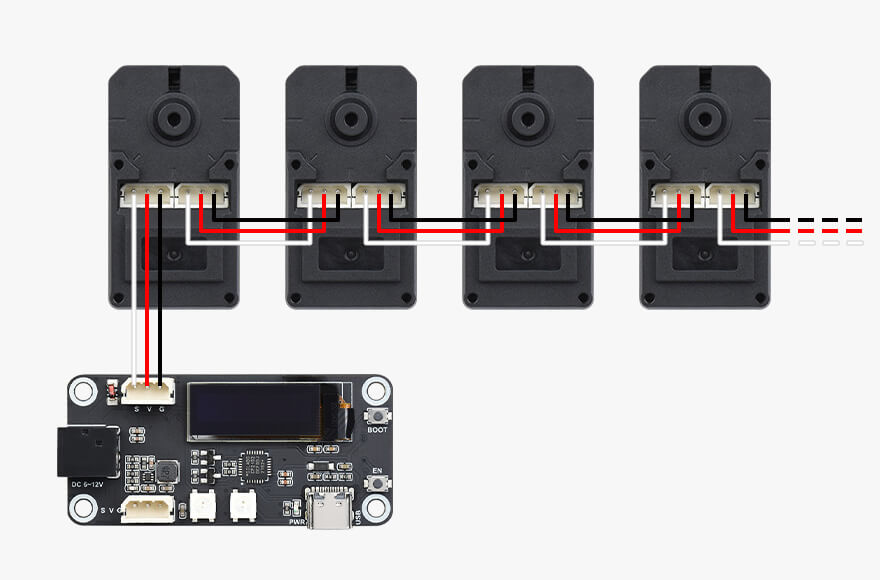

# micropython-WSD-ESP32


It can be installed from [mip](https://docs.micropython.org/en/latest/reference/packages.html#installing-packages-with-mip) via:
```
>>> import mip
>>> mip.install("github:aadankan/micropython-wsd-esp32")
```

# micropython-WSD-ESP32

The **WSD ESP32** is a MicroPython library for controlling the WSD ESP32 board.

---

## Installation

It can be installed from [mip](https://docs.micropython.org/en/latest/reference/packages.html#installing-packages-with-mip) via:

```python
import mip
mip.install("github:aadankan/micropython-wsd-esp32")
```

---

## Usage
```python
import time

from wsd_esp32.rgb_led import RGBLed
led = RGBLed(23, 2) 
led.clear()
led.set_pixel(0, 0, 255, 0)  # lights up only the first LED (index 0) in green
time.sleep(1)  # waits for 1 second
led.clear()
led.set_pixel(1, 255, 0, 0)  # lights up the second LED (index 1) in red
time.sleep(1)  # waits for another second
led.clear()  # clears all LEDs
led.set_color(0, 0, 255)  # sets all LEDs to blue
time.sleep(2) # waits for 2 seconds
led.clear() # clears all LEDs again

from wsd_esp32.oled_display import OledDisplay
oled = OledDisplay()
oled.clear()  # clears the OLED display
oled.write("Hello")  # writes "Hello" on the OLED display
time.sleep(2)  # waits for 2 seconds
oled.write("World!", 0, 8)  # writes "World!" on the OLED display at position (0, 8)
time.sleep(2)  # waits for another 2 seconds
oled.clear()  # clears the OLED display again

# Uncomment if you have a servo connected to the board
# from st3215 import ST3215
# servo = ST3215()  # initializes a servo
# (servo.move_target_location(4000, speed=1000)) # moves the servo to a target location with a speed of 1000
# time.sleep(3)  # waits for 3 seconds
# servo.move_target_location(0, speed=1000)  # moves the servo back to the initial position
```

## Features
- **RGB LED Control**: Set the color of the onboard RGB LED.
- **Oled Display**: Control the onboard OLED display.
- **Servo Control**: Control servos connected to the board.

---

## Requirements
- **WSD ESP32 Board**: The library is specifically tailored for the WSD ESP32 board.
- **MicroPython**: Ensure you have MicroPython installed on your ESP32 board.

## Possible Wiring Diagram with servos



